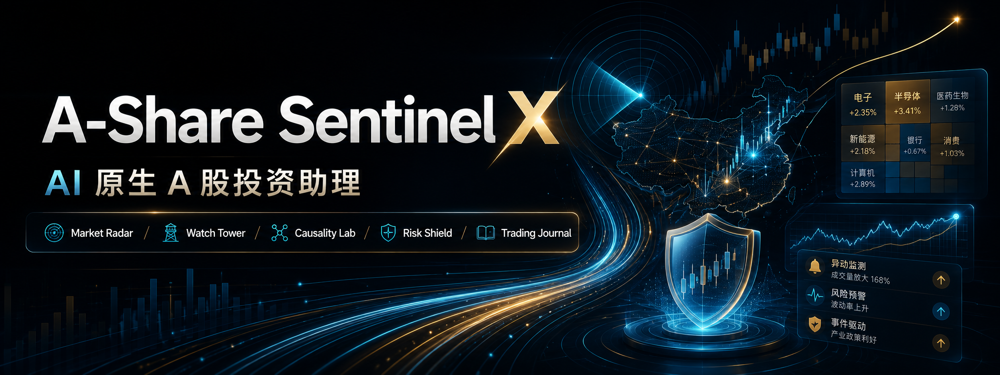

# A-Share Sentinel X｜AI 原生 A 股投资助理 MVP

面向 A 股投资者的 **AI 自动看盘、AI 自动盯盘、AI 自动解盘** MVP。

**[🔗 a-share-sentinel-x.vercel.app](https://a-share-sentinel-x.vercel.app)**

本项目基于现有 NexusTrade 模拟交易终端升级而来，将行情面板、模拟账户、AI 引擎、用户盯盘规则、风险护盾与盘后复盘整合为一个完整的 AI 原生投资助理产品原型。

项目目标不是做一个普通行情看板，而是验证：

> AI 是否可以帮助工作日无法持续盯盘的 A 股投资者，降低市场跟踪门槛，提升理解市场动态与管理模拟持仓的效率。


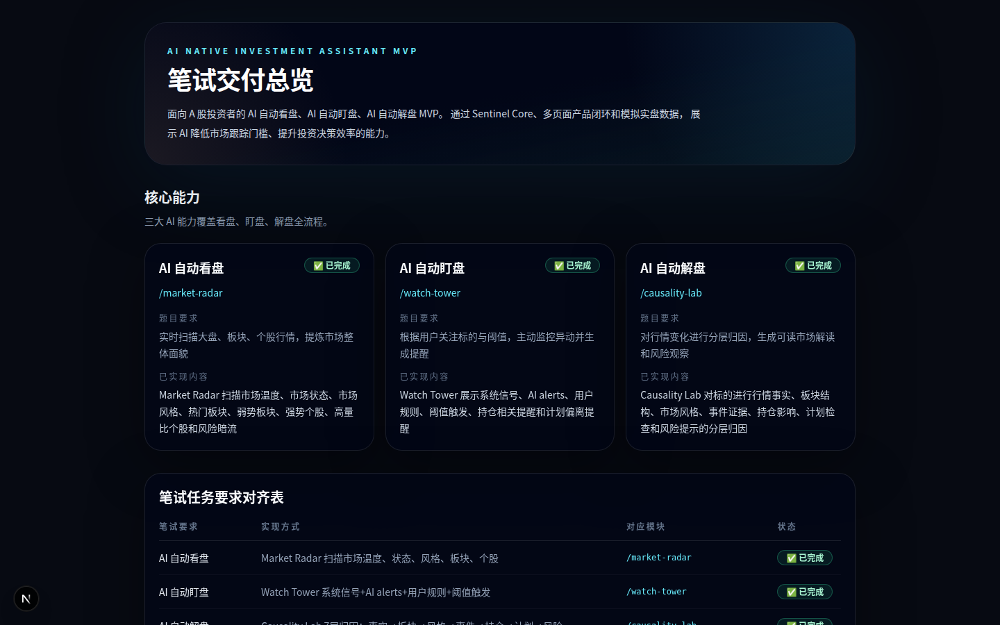

---

## 1. 项目背景

A 股投资者经常面对以下问题：

- 工作时间无法持续盯盘；
- 大盘、板块、个股信息过载；
- 个股异动发生后，不知道原因来自市场、板块、资金还是个股自身；
- 关注标的较多，但缺少自动化提醒；
- 交易后缺少系统复盘，难以沉淀经验；
- 普通行情软件主要展示数据，较少提供结构化解释。

因此，本项目设计了一套 AI 原生投资助理流程：

```text
市场扫描
→ 用户盯盘规则
→ AI 异动提醒
→ AI 归因解盘
→ 风险护盾
→ 盘后复盘
```

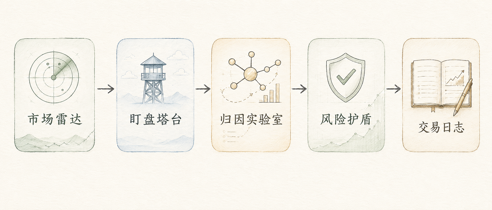

---

## 评审 3 分钟快速阅读

如果只想快速判断本项目是否完成笔试要求，建议按以下顺序查看：

1. `/submission` — 笔试交付总览，查看三大能力如何对齐题目要求
2. `/market-radar` — AI 自动看盘
3. `/watch-tower` — AI 自动盯盘，包含用户关注标的和阈值规则
4. `/causality-lab` — AI 自动解盘，查看分层归因和证据链
5. `/risk-shield` — 组合风险护盾
6. `/trading-journal` — AI 盘后复盘

---

## 2. 笔试题要求对齐

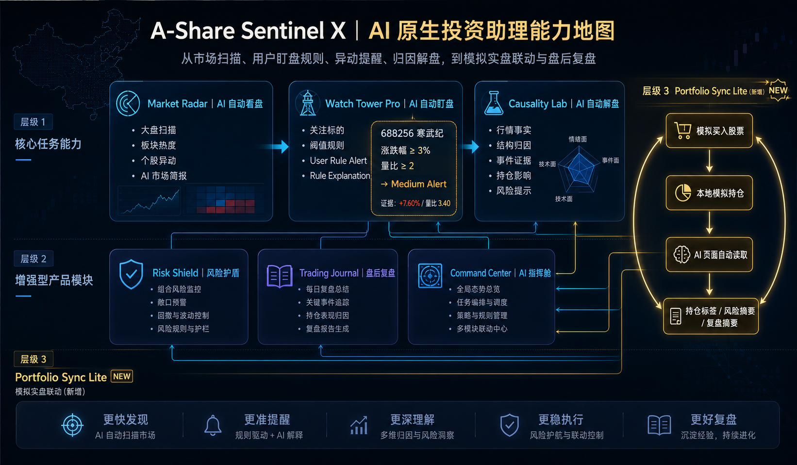

| 笔试要求 | 实现页面 | 核心实现 | 状态 |
| --- | --- | --- | --- |
| AI 自动看盘 | `/market-radar` | 市场温度、状态、风格、板块热度、强势个股、风险暗流、AI 市场简报 | 已完成 |
| AI 自动盯盘 | `/watch-tower` | 用户关注标的、阈值设置、localStorage 规则、启停、触发提醒、证据解释 | 已完成 |
| AI 自动解盘 | `/causality-lab` | 行情事实、板块结构、市场风格、事件证据、持仓影响、计划检查、风险提示 | 已完成 |
| GitHub 源码 | 当前仓库 | 完整 Next.js 源码、核心引擎、页面、截图和 README | 已准备 |
| README | `README.md` | 项目介绍、架构、功能、运行方法、AI 使用情况、问题和后续优化 | 已完成 |

---

## 3. 推荐评审入口

建议先打开：

```text
/submission
```

该页面用于快速查看：

- 项目如何对齐笔试题；
- 三大核心能力如何实现；
- 产品闭环；
- 技术架构；
- 推荐演示路径；
- 合规说明。

---

## 4. 功能说明

### 4.1 AI 自动看盘｜Market Radar

页面路径：`/market-radar`

功能包括：市场温度、市场状态、市场风格、上涨/下跌/平盘家数、热门板块、弱势板块、强势个股、高量比个股、风险暗流、AI 市场简报。

该页面不是普通涨跌榜，而是将大盘、板块、个股信号聚合成一份结构化市场扫描报告。

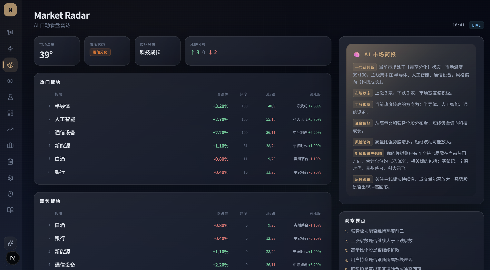

### 4.2 AI 自动盯盘｜Watch Tower Pro

页面路径：`/watch-tower`

核心能力：用户添加关注标的、设置涨跌幅/量比/回撤/板块涨跌幅阈值、启用/停用/删除规则、localStorage 本地保存、用户规则触发提醒、触发证据展示、Rule Explanation 生成。

示例演示：用户添加 `688256 寒武纪`，设置涨跌幅阈值 `≥ 3%`、量比阈值 `≥ 2`。系统检测到当前模拟涨幅 `7.60%`、量比 `3.40`，触发用户规则提醒并展示证据链。

对应文件：`src/lib/watch-rule-storage.ts`、`src/lib/watch-rule-engine.ts`、`src/app/watch-tower/page.tsx`

**模拟实盘联动**：用户在模拟交易系统中买入股票后，AI 指挥舱、盯盘塔、解盘、风险护盾和盘后复盘页面会读取本地模拟持仓并展示持仓相关标记或摘要。

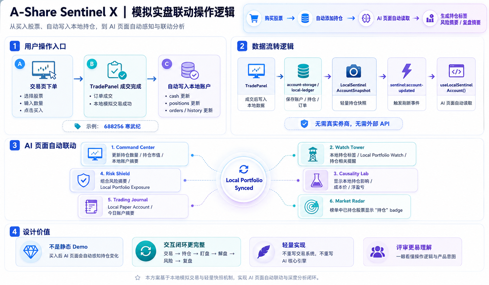

> 联动机制：`TradePanel` 成交后触发 `sentinel:account-updated` 事件 → `useLocalSentinelAccount` hook 自动刷新 → 6 个 AI 页面实时展示本地持仓。适配器 `sentinel-local-account-adapter.ts` 负责将现有 `nexus-trade-*` localStorage 结构转为 AI 页面可读的轻量快照，不动原交易系统。


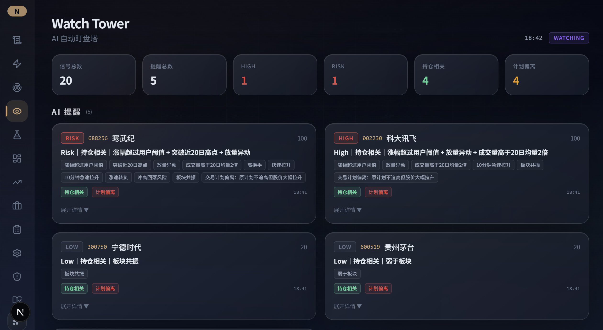

### 4.3 AI 自动解盘｜Causality Lab

页面路径：`/causality-lab`

该页面按证据链分层归因：行情事实 → 浅层归因 → 结构归因 → 市场风格归因 → 事件/政策/公司归因 → 用户持仓影响 → 交易计划检查 → 风险提示 → 后续观察指标。

如果系统没有接入可验证实时公告或新闻，会明确提示当前未接入实时公告数据，不做确定性事件归因。

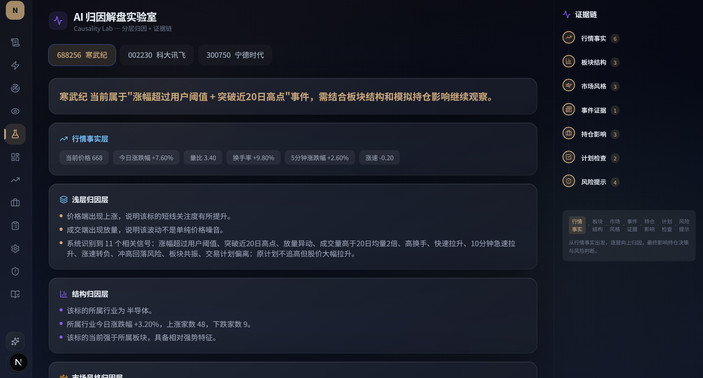

---

## 5. 增强功能

### 5.1 AI 指挥舱｜Command Center
页面路径：`/command-center`。展示模拟账户核心指标、市场温度/状态/风格、AI 一句话判断、Top alerts、风险摘要、解盘摘要、Agent 状态、Sentinel Pulse、Live Intelligence Feed。

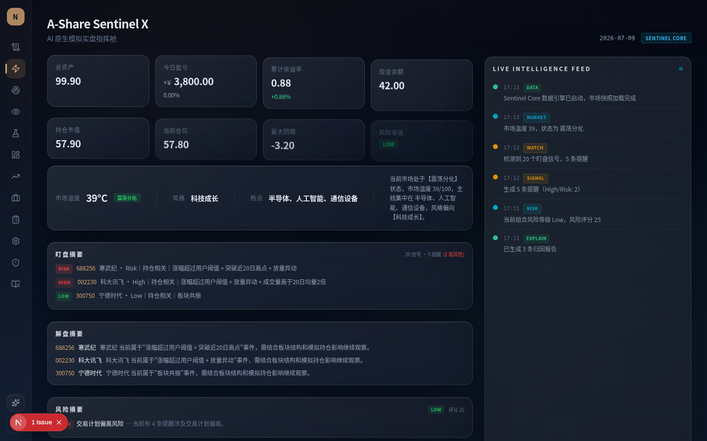

### 5.2 风险护盾｜Risk Shield
页面路径：`/risk-shield`。回答"当前模拟账户的主要风险在哪里"：风险等级、风险分数、风险来源、影响持仓、证据、后续观察、风险与提醒联动。

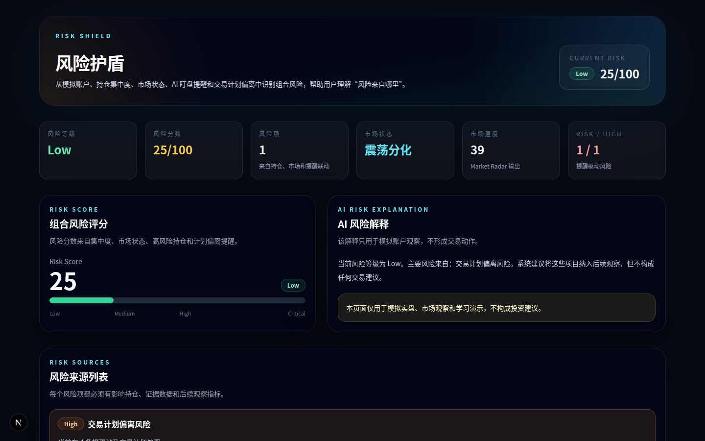

### 5.3 AI 盘后复盘｜Trading Journal
页面路径：`/trading-journal`。展示今日账户表现、市场环境、提醒复盘、模拟交易回顾、持仓风险变化、明日观察清单、AI 盘后总结。

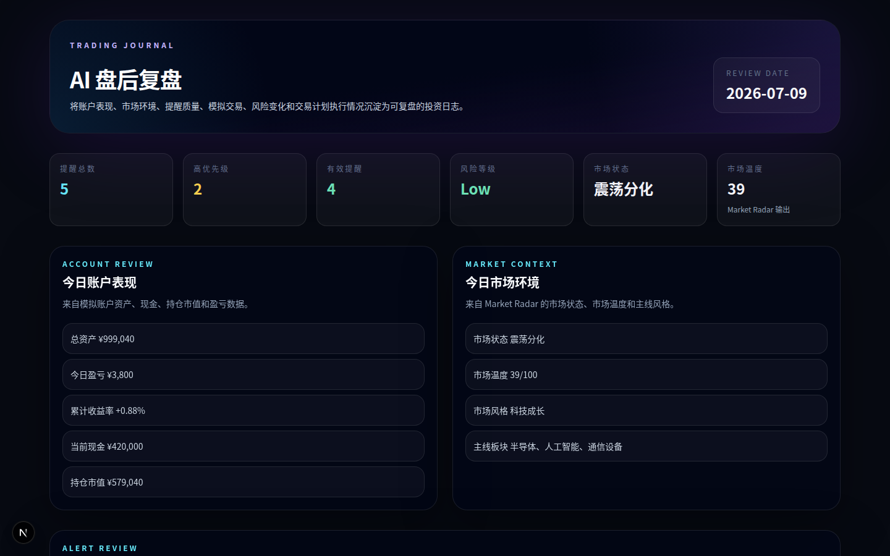

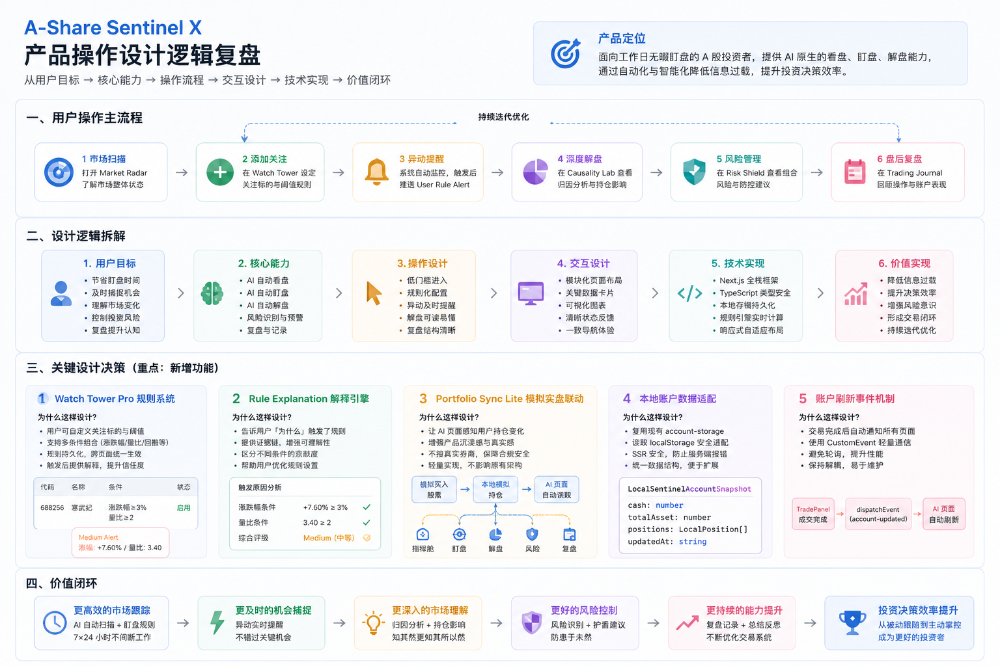

---

## 6. 推荐演示路径

1. `/submission` — 查看项目如何对齐笔试要求
2. `/command-center` — 查看 AI 指挥舱总览
3. `/market-radar` — 查看 AI 自动看盘
4. `/watch-tower` — 设置或查看用户盯盘规则与触发提醒
5. `/causality-lab` — 查看 AI 自动解盘和证据链
6. `/risk-shield` — 查看组合风险护盾
7. `/trading-journal` — 查看 AI 盘后复盘

---

## 7. 页面截图

截图位于 `docs/screenshots/`：

| 页面 | 截图 |
| --- | --- |
| 交付总览 | `docs/screenshots/01-submission.png` |
| AI 指挥舱 | `docs/screenshots/02-command-center.png` |
| AI 自动看盘 | `docs/screenshots/03-market-radar.png` |
| AI 自动盯盘 | `docs/screenshots/04-watch-tower.png` |
| AI 自动解盘 | `docs/screenshots/05-causality-lab.png` |
| 风险护盾 | `docs/screenshots/06-risk-shield.png` |
| AI 盘后复盘 | `docs/screenshots/07-trading-journal.png` |

---

## 8. 技术架构

**Frontend**: Next.js + React + TypeScript + Tailwind CSS + Framer Motion + Lucide React

**Core Engine**: `src/lib/sentinel-core.ts` — marketRadarEngine / signalEngine / alertEngine / causalityEngine / riskEngine / journalEngine / complianceEngine / runSentinelCore

**Watch Rules**: `src/lib/watch-rule-storage.ts` + `src/lib/watch-rule-engine.ts`

**UI Pages**: 7 个页面路由（submission / command-center / market-radar / watch-tower / causality-lab / risk-shield / trading-journal）

### 系统架构

```text
┌──────────────────────────────────────────────┐
│              Next.js App Router               │
├──────────────────────────────────────────────┤
│ /submission       笔试交付总览                 │
│ /command-center   AI 指挥舱                    │
│ /market-radar     AI 自动看盘                  │
│ /watch-tower      AI 自动盯盘                  │
│ /causality-lab    AI 自动解盘                  │
│ /risk-shield      风险护盾                     │
│ /trading-journal  AI 盘后复盘                  │
├──────────────────────────────────────────────┤
│ Sentinel Core                                  │
│ marketRadarEngine / signalEngine / alertEngine │
│ causalityEngine / riskEngine / journalEngine   │
├──────────────────────────────────────────────┤
│ Watch Rules                                    │
│ watch-rule-storage / watch-rule-engine         │
├──────────────────────────────────────────────┤
│ Mock A-share Data + Paper Account              │
└──────────────────────────────────────────────┘
```

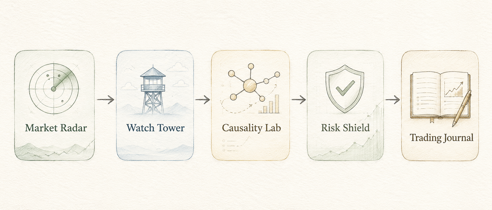

---

## 9. 数据源说明

本 MVP 当前使用模拟 A 股行情与模拟账户数据完成演示。

设计原因：笔试题允许使用模拟数据、评审无需配置 API Key、非交易时间也能看到完整功能、用户规则/提醒/解盘/风险/复盘都能稳定触发。

后续可扩展：AkShare、Tushare、交易所行情快照、自选股实时行情、公告/新闻/研报数据源。

---

## 10. 运行方法

```bash
npm install
npm run dev -- -p 3458
```

访问 `http://localhost:3458`

```bash
npx tsc --noEmit   # 类型检查
npm run build      # 构建
```

---

## 提交内容

本仓库用于提交笔试题要求的 GitHub Repository，包含：

- 完整源码
- README.md
- 核心页面截图
- AI 自动看盘、盯盘、解盘核心实现
- Watch Tower Pro 用户规则系统
- TypeScript 与 build 验证结果

提交前验证：

```bash
npx tsc --noEmit
npm run build
```

当前版本以本地运行和 GitHub 源码提交为主。

---

## 11. 当前验证结果

- `npx tsc --noEmit` → 通过
- `npm run build` → 通过
- 核心路由访问 → 全部 200
- 核心页面 → 无白屏
- 截图资产 → 已生成
- 合规禁词检查 → 通过

已验证路由：/ /submission /command-center /market-radar /watch-tower /causality-lab /risk-shield /trading-journal /portfolio /orders /settings /mobile

---

## 12. 开发过程

本项目基于现有 NexusTrade 模拟交易终端升级，分三个阶段完成：

**Phase 1 — 核心引擎**：创建 `sentinel-core.ts` 包含 9 个引擎（看盘/盯盘/提醒/解盘/风险/复盘/合规），支持一键 `runSentinelCore()` 生成完整演示数据。

**Phase 2 — 页面接入**：7 个核心页面全部接入引擎，新增 `/submission` 笔试对齐页。Watch Tower Pro 实现用户规则驱动盯盘（localStorage + 规则引擎 + 触发解释）。

**Phase 3 — 增强闭环**：Portfolio Sync Lite 实现模拟持仓联动。品牌统一为 A-Share Sentinel X。清理旧 NexusTrade 残留。README 图文增强、截图、流程图、对齐表、合规说明全部到位。

全程使用 AI Coding 工具完成代码生成、审查、QA 和文档。

---

## 13. AI 使用情况

当前 MVP 没有依赖真实大模型 API 在线推理，而是使用模拟行情、规则引擎和结构化 AI 产品工作流来演示 AI 原生投资助理的核心交互逻辑。后续可以接入真实 LLM、公告、新闻和行情数据源。

AI Coding 工具辅助完成了：项目结构审计、产品方向确定、Sentinel Core 引擎设计、看盘/盯盘/解盘逻辑拆解、多页面 UI 接入、Watch Tower Pro 用户规则系统、风险护盾与盘后复盘、笔试交付总览、TypeScript 修复、Final QA、截图和合规检查。

---

## 14. 遇到的问题与解决方案

**问题 1**：如何在没有真实行情 API 的情况下演示完整流程？→ 使用模拟 A 股市场快照、模拟账户、模拟持仓、模拟 signals/alerts，评审打开即可看到完整闭环。

**问题 2**：普通 alerts 展示不足以满足"自动盯盘" → 新增 Watch Tower Pro：用户关注标的 → 阈值设置 → localStorage 保存 → 规则引擎评估 → 触发提醒 → 证据解释。

**问题 3**：AI 解盘容易变成普通文本 → 将解盘拆成分层证据链：行情事实 → 板块结构 → 市场风格 → 事件证据 → 持仓影响 → 计划检查 → 风险提示。

**问题 4**：投资类产品存在合规风险 → 新增 complianceEngine 和页面风险提示，避免直接投资建议、确定性收益、买卖指令等表达。

---

## 15. 后续优化方向

1. 接入真实 A 股行情数据
2. 接入公告、新闻、研报数据源
3. 支持用户登录与云端规则同步
4. 支持 WebSocket 实时提醒
5. 支持更复杂的盯盘规则组合
6. 支持自然语言创建盯盘规则
7. 增加 Agent Console，展示 AI 决策过程
8. 增加 Portfolio MRI，做持仓 X 光分析
9. 增加回测与提醒有效性评估
10. 增加移动端完整盯盘体验

---

## 16. 合规说明

本项目仅用于 AI 原生投资助理 MVP 演示、模拟实盘、市场观察和学习展示。项目中的所有行情、账户、提醒、解盘、风险与复盘内容均不构成投资建议，不代表真实市场结论，不承诺收益，不提供买卖指令。
